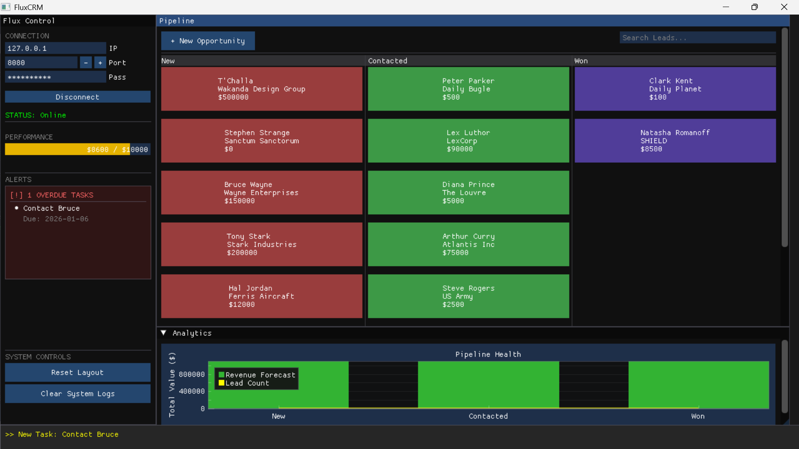

# FluxCRM 📊

**FluxCRM** is a high-performance, dark-themed Customer Relationship Management dashboard built in C++ using **ImGui** and **DirectX 11**.

It serves as the flagship frontend for the **[FluxDB](https://github.com/PranavKndpl/FluxDB)** ecosystem, demonstrating how to build distributed, real-time applications using the FluxDB custom TCP protocol.

Designed for speed and usability, it features a **Drag-and-Drop Kanban Board**, **Real-Time Event Streaming**, and a **Dual-Head Architecture** (GUI + CLI).



*The FluxCRM Dashboard featuring the Kanban Pipeline and Analytics.*

---

## 🌟 Key Features

* **🎨 Visual Pipeline**: A fully interactive Kanban board. Drag and drop leads between "New", "Contacted", and "Won" stages to update their status instantly in the database.
* **⚡ Real-Time Ticker**: Uses FluxDB's **Pub/Sub** engine to stream live updates. When a lead is modified (even from the CLI), the GUI updates instantly.
* **🔌 Dual-Head Architecture**: A single executable that runs in two modes:
* **GUI Mode**: A hardware-accelerated dashboard with charts and modals.
* **CLI Mode**: A lightweight terminal interface for scripting and remote management.


* **📈 Integrated Analytics**: Built-in revenue forecasting and lead volume tracking using **ImPlot**.
* **🛡️ Robust Networking**:
* Uses a custom, from-scratch C++ TCP client (`FluxDBClient`).
* Implements manual JSON serialization/deserialization without external heavy frameworks.
* Non-blocking event listening on a dedicated background thread.


* **📝 Task & History Logging**: Attach tasks with validation (YYYY-MM-DD) and history logs to specific leads.

---

## 📥 Installation & Usage

### Option A: Download Binaries (Recommended)

1. Ensure your **FluxDB Server** (`fluxd.exe`) is running on `127.0.0.1:8080`.
2. Download **[FluxCRM v1.0 Release](https://github.com/PranavKndpl/FluxCRM/releases/tag/V1.0)**.
3. Run `flux_crm.exe`.

### Option B: Build from Source

**Requirements:**

* MinGW (g++) with C++17 support.
* Windows SDK (for DirectX/Win32 libraries).

**Compilation:**
The project includes a smart build script (`build.bat`) that handles incremental compilation. It compiles the UI libraries (ImGui/ImPlot) once and caches them to speed up development.

```bash
# 1. Clone the repository
git clone https://github.com/PranavKndpl/FluxCRM.git
cd FluxCRM

# 2. Run the build script
.\build.bat

# Output: bin/flux_crm.exe

```

---

## 🖥️ CLI Mode

FluxCRM includes a "Headless" mode for system administrators or automated scripts. To start it, pass the `--cli` flag.

```bash
./bin/flux_crm.exe --cli

```

### Supported Commands

| Command | Usage | Description |
| --- | --- | --- |
| **CONNECT** | `CONNECT <ip> <port> <pass>` | Connect to the FluxDB server. |
| **ADD** | `ADD <name> <comp> <val>` | Create a new lead. |
| **LIST** | `LIST <stage>` | List leads in "New", "Contacted", or "Won". |
| **PROMOTE** | `PROMOTE <id> <stage>` | Move a lead to a new stage. |
| **GOAL** | `GOAL <amount>` | Set the revenue target for the dashboard. |
| **STATS** | `STATS` | View pipeline health and total revenue. |
| **IMPORT** | `IMPORT <file.csv>` | Bulk import leads from CSV. |
| **EXPORT** | `EXPORT <file.csv>` | Dump current database to CSV. |

---

## 🛠️ Technical Architecture

FluxCRM is designed to decouple the **Presentation Layer** (ImGui) from the **Data Layer** (FluxDB).

### 1. The "Flux" Protocol

Instead of using HTTP/REST, FluxCRM communicates with FluxDB via raw TCP sockets using a lightweight text protocol:

```text
Request:  INSERT {"type": "lead", "name": "Stark", "value": 5000}
Response: OK ID=105

```

### 2. Event System

The application spawns a background thread (`EventTicker`) that holds a persistent connection to the database. It subscribes to the `crm_events` channel.

* **Flow:** User drags card -> Client sends `UPDATE` -> Database publishes to `crm_events` -> Ticker Thread receives message -> GUI displays notification.

### 3. Directory Structure

```text
FluxCRM/
├── src/
│   ├── cli/             # Headless CLI logic
│   ├── ui/              # ImGui layout & components (Pipeline, Sidebar)
│   ├── crm_core.hpp     # Business Logic Controller
│   └── main.cpp         # Entry point & Mode selection
├── vendor/
│   ├── fluxdb/          # The C++ Driver (Document, Client, Parser)
│   ├── imgui/           # UI Framework
│   └── implot/          # Charting Library
├── build.bat            # Incremental build script
└── README.md            # Documentation

```

---

## 🤝 Contributing

This project is a demonstration of the **FluxDB C++ Driver**.
If you want to add features (e.g., User Authentication, PDF Reporting), feel free to fork the repo!

1. Fork the Project
2. Create your Feature Branch (`git checkout -b feature/AmazingFeature`)
3. Commit your Changes (`git commit -m 'Add some AmazingFeature'`)
4. Push to the Branch (`git push origin feature/AmazingFeature`)
5. Open a Pull Request

---

## 📄 License

Distributed under the MIT License. See `LICENSE` for more information.

Copyright (c) 2026 Pranav